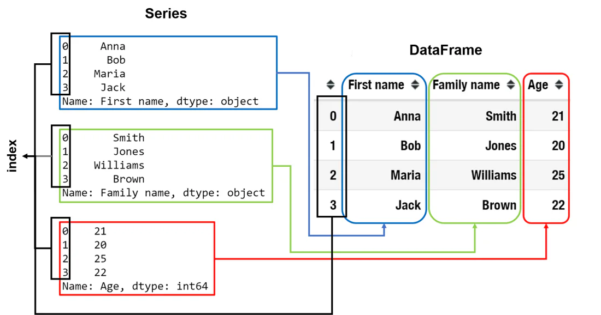

# Clase 4: Introducción a pandas

En la práctica, los datos a menudo se almacenan en forma de tabla, por ejemplo, una hoja de cálculo de Excel, un archivo CSV o una base de datos SQL. Imagina que necesitas analizar estos datos tabulares y obtener información útil de ellos. Pensemos en las tareas que necesitarás realizar.

Primero, necesitarás cargar datos de diferentes formatos preservando su estructura tabular y probablemente unir varias tablas juntas. Luego, para realizar el análisis de datos real, definitivamente querrás acceder a diferentes columnas, filas y celdas de las tablas, calcular algunas estadísticas generales, crear tablas dinámicas y tal vez incluso hacer gráficos básicos. ¿Existe una herramienta en Python que combine todas estas funcionalidades? ¡La respuesta es sí!

Este tema te introducirá a **pandas**, una poderosa biblioteca de código abierto para la manipulación y análisis de datos. Aprenderás cómo instalar la biblioteca y obtendrás una idea de su funcionalidad principal.


## Instalando pandas

pandas no está incluido en la biblioteca estándar de Python, por lo que podrías necesitar instalarlo por separado, por ejemplo, usando pip. Escribe lo siguiente en tu línea de comandos:

```python
pip install pandas
```

Ten en cuenta que pandas está construido sobre NumPy, que también se instalará. Además, hay muchas dependencias opcionales. Por ejemplo, si quieres usar la funcionalidad de visualización de datos de pandas, necesitas instalar matplotlib, una biblioteca de gráficos en Python. Puedes instalar esas bibliotecas usando pip también.

Una vez que la instalación esté completa, podrás importarlo en tu código. Como pandas es un nombre bastante largo, comúnmente se abrevia y se importa como pd:

```python
import pandas as pd
```


Nota que se lanzan nuevas versiones de pandas de vez en cuando, con nuevas funcionalidades y errores corregidos. Así que sería una buena idea estar atento a las actualizaciones. Puedes actualizar fácilmente la versión de pandas en tu máquina con este comando: `pip install --upgrade pandas`.

## Dentro de pandas

Como se indica en sus directrices, pandas tiene como objetivo convertirse en "la herramienta de análisis/manipulación de datos de código abierto más poderosa y flexible disponible en cualquier lenguaje".

El nombre pandas se deriva de 'panel data' (datos de panel), un término que se usa en estadística y econometría para referirse a conjuntos de datos que contienen observaciones durante múltiples períodos de tiempo para los mismos individuos. Esta biblioteca será útil si estás trabajando con datos tabulares, como datos almacenados en hojas de cálculo o bases de datos. Aparte de eso, pandas ofrece un gran soporte para series temporales y proporciona una funcionalidad extensa para trabajar con fechas, horas y datos indexados por tiempo.

Con la ayuda de pandas, uno puede realizar fácilmente los pasos de procesamiento de datos más típicos. En particular, el paquete hace conveniente cargar y guardar datos, ya que admite integración lista para usar con muchos formatos tabulares de uso común como .csv, .xlsx, así como bases de datos SQL.

¡Veamos qué más podemos obtener de pandas!

- La fusión e unión intuitiva de conjuntos de datos permite combinar fácilmente datos de diferentes fuentes, mientras que las herramientas flexibles de remodelación ayudan a construir resúmenes de datos estadísticos.

- Con pandas podemos editar, ordenar, remodelar y explorar datos tabulares. Por ejemplo, podrías obtener todos los valores únicos de una columna con solo un comando.

- Los valores faltantes en los datos se representan como NaN y pueden manejarse fácilmente, por ejemplo, pueden ser reemplazados por algún valor, usando funcionalidad incorporada.

- Si instalas matplotlib, una biblioteca de gráficos de Python, puedes usar la funcionalidad de gráficos incorporada de pandas para hacer un gráfico básico a partir de tus datos para entenderlos mejor.

- Puedes obtener información estadística básica sobre tus datos con literalmente una línea de código.

- Puede integrarse con otras bibliotecas para aprendizaje automático, como sklearn.

Finalmente, pandas es software de código abierto, lo que lo hace muy popular tanto en dominios académicos como comerciales. Para descubrir el potencial completo de pandas, echa un vistazo a la [documentación](https://pandas.pydata.org/docs/).

## Estructuras de datos en pandas

Las dos estructuras de datos de pandas son **Series** (1D) y **DataFrame** (2D). Te familiarizarás más con ellas en los temas dedicados — solo proporcionaremos una descripción general.

### Series

**Series** es un array unidimensional que almacena elementos del mismo tipo de datos.

Cada elemento almacenado en una Series está asociado con una etiqueta llamada índice. Por defecto, este índice es solo una secuencia (0, 1, 2, ...). Sin embargo, puedes usar cualquier valor personalizado. Por ejemplo, al analizar series temporales, las marcas de tiempo se establecen típicamente como índices.

Los índices, así como la alineación de datos automática y explícita basada en ellos, son el núcleo de pandas.

### DataFrame

**DataFrame**, a su vez, es una estructura de datos bidimensional que se usa para representar datos tabulares con columnas de tipos de datos potencialmente diferentes. Puedes ver DataFrame como una tabla, cada columna de la cual es un objeto Series. En otras palabras, DataFrame es un contenedor para Series, mientras que Series es un contenedor para escalares.

Esto se ilustra con el ejemplo siguiente. Los tres objetos Series almacenan nombres, apellidos y edades de estudiantes respectivamente, mientras que el DataFrame combina esta información en una sola tabla.



Ten en cuenta que cada fila en el DataFrame también está asociada con un índice (que puede ser numérico o basado en etiquetas). Vale la pena mencionar que aunque DataFrame es una estructura de datos 2D, aún se puede usar para representar datos de mayor dimensión utilizando el llamado multi-índice, es decir, asignando varios índices, o etiquetas, a cada fila.

Las tablas representadas como DataFrame difieren ligeramente de las hojas de cálculo para optimizar los cálculos. Series (= columnas de un DataFrame) pueden almacenar datos de un solo tipo para realizar operaciones en ellos más rápido. Series usa arrays de NumPy (o sus extensiones) bajo el capó, y se impone la misma limitación de tipo de datos debido a la optimización.

### Una nota sobre el uso del 'mismo tipo de datos'

En pandas, al agregar o eliminar valores de un objeto Series, se crea un nuevo objeto Series. Esto ayuda a pandas a administrar eficientemente el uso de memoria para Series. Específicamente:

- **Agregar valores**: no es posible agregar valores directamente a un objeto Series existente. En cambio, cuando realizas una operación que parece agregar valores a una Series, pandas crea un nuevo objeto Series con los valores combinados de la Series original y los valores agregados.

- **Eliminar valores**: por defecto, eliminar valores de una Series también crea un nuevo objeto Series que contiene solo los valores restantes. Sin embargo, pandas proporciona una opción para modificar el objeto Series existente en su lugar al eliminar valores, aunque esto aún implica crear una copia del objeto original internamente.

En ambos casos de agregar o eliminar valores, incluso cuando se modifica la Series en su lugar, pandas genera una copia del objeto original para garantizar que los datos originales permanezcan sin cambios. Esta operación de copia se realiza eficientemente y ayuda a mantener la inmutabilidad de los objetos pandas.

Dado que pandas está diseñado para preservar la inmutabilidad, generalmente no se recomienda realizar operaciones en su lugar, porque modificar el objeto original en lugar de crear un nuevo objeto podría conducir a resultados inesperados y problemas con la depuración del código.

## Conclusión

Esto es lo que debes saber sobre pandas:

- pandas es una herramienta flexible para el análisis de datos.

- pandas es una herramienta perfecta para trabajar con datos heterogéneos.

- Hay dos estructuras de datos en pandas: Series (1D) y DataFrame (2D).

- Series almacena valores del mismo tipo de datos, mientras que las columnas en un DataFrame pueden ser de diferentes tipos.
